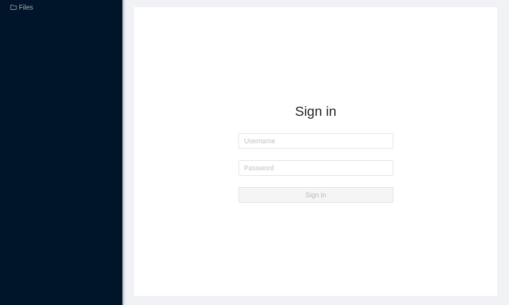
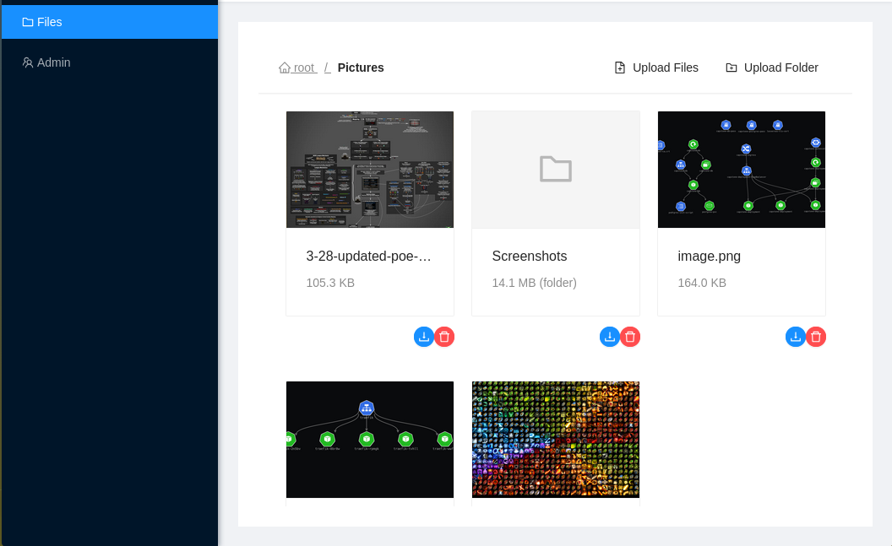
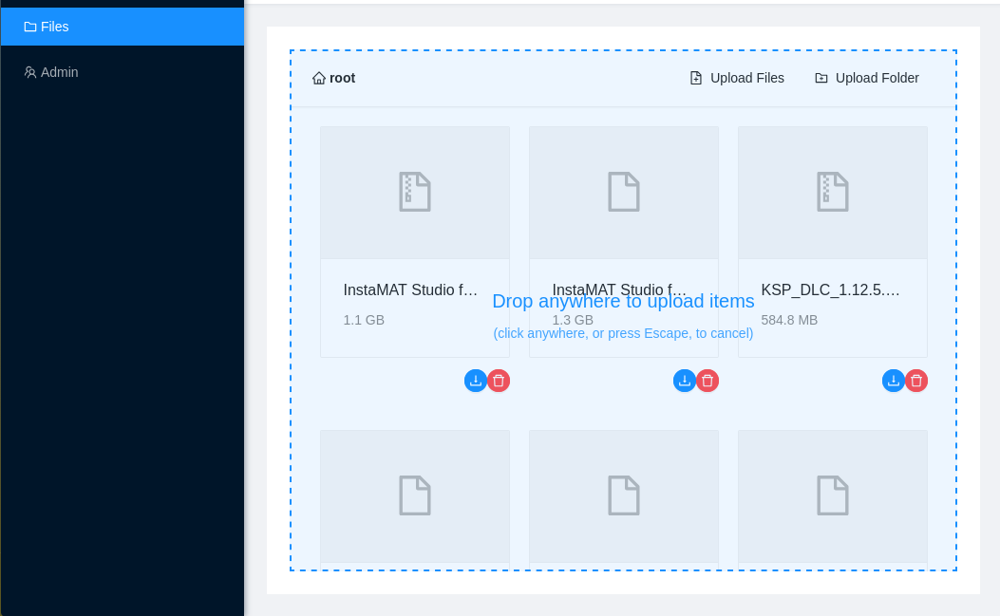
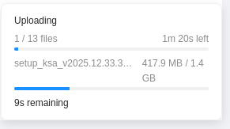
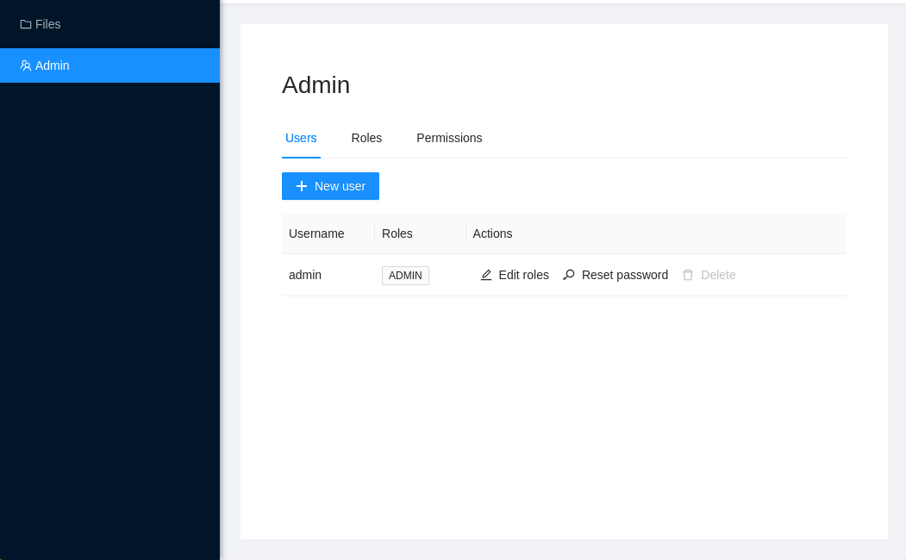
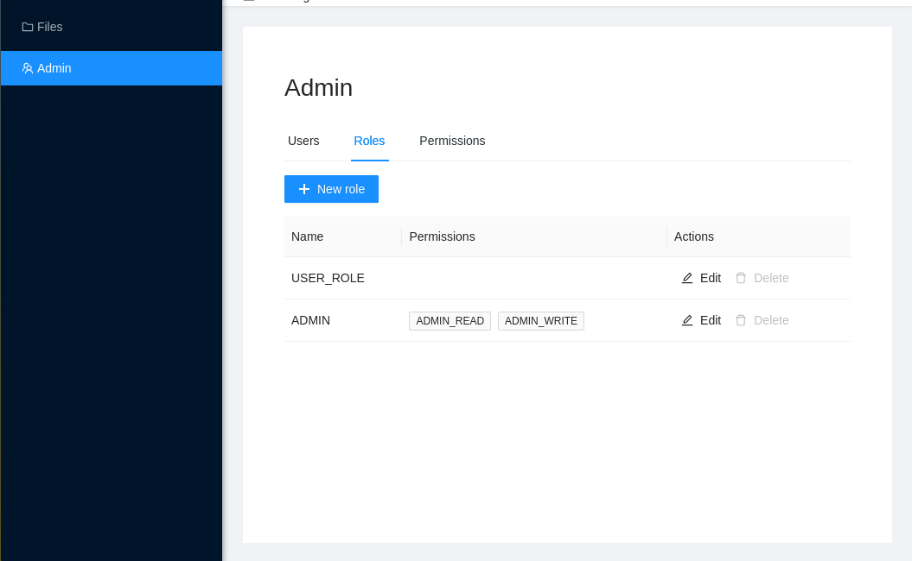
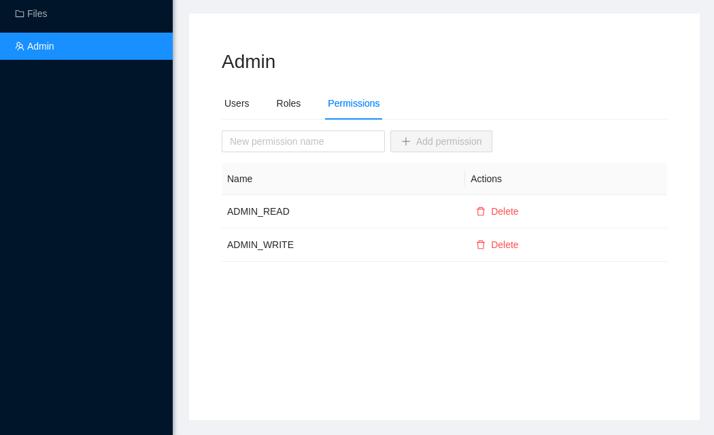

# AnzenFS

A secure web file manager (Spring Boot backend + Angular frontend).

## Getting AnzenFS

The recommended way to get AnzenFS is to download a precompiled build from the
[GitHub Releases page](https://github.com/GuillaumeVern/anzen-fs/releases). Each release is a
single, self-contained native binary: no JVM, Node.js, or build tools required on the target
machine.

Building from source is also supported and described below, for anyone who wants to build a
custom version or contribute to the project.

## Building from source

### Requirements

- **GraalVM Community Edition 25** for native compilation (recommended for production builds).
- Alternatively, a plain **JDK 25** + **Maven** are enough for the classic JVM mode.
- **Node.js 22** is required to build the Angular frontend, but it is installed automatically by
  Maven (`frontend-maven-plugin`), so no manual installation is needed.

### Native binary (recommended for production)

```
./mvnw clean package -Pnative native:compile
```

Produces a self-contained executable at `target/anzenfs`, with no dependency on a JVM installed
on the target machine.

### Classic JAR (development)

```
./mvnw clean package
./mvnw spring-boot:run
```

## Configuration

No secrets need to be provided manually at startup:

- **Database**: SQLite, stored automatically in the application's data directory.
- **JWT secret**: generated randomly (512 bits) on first startup and persisted in that same
  directory with owner-only permissions (`chmod 600`); see `JwtSecretStore`. It is never
  committed to version control.
- **Initial admin password**: the built-in `admin` account is created on first startup with a
  randomly generated password (144 bits), persisted the same way as the JWT secret (owner-only
  permissions, in the application data directory, under `admin.initial-password`); see
  `AdminPasswordStore`. Retrieve it from that file after the first startup, sign in as `admin`,
  and change the password from the admin panel.

The default data directory is `~/.local/share/anzenfs`. It can be overridden with the
`XDG_DATA_HOME` environment variable (the directory used then becomes `$XDG_DATA_HOME/anzenfs`),
which is useful for isolating multiple environments (e.g. staging/production) on the same
machine.

## Running

```
./target/anzenfs
```

or, in JAR mode:

```
java -jar target/anzenfs-0.0.1-SNAPSHOT.jar
```

The application listens on port 8080 by default and serves both the REST API (`/api/**`) and the
compiled Angular frontend.

## TLS / HTTPS

AnzenFS does not terminate TLS itself: it is designed to run behind a reverse proxy. A common
setup is **Traefik**, which can issue and renew a **Let's Encrypt** certificate automatically.

Setting up TLS termination (reverse proxy, certificate) is the operator's responsibility when
self-hosting AnzenFS: the application should not be exposed directly to the Internet over plain
HTTP without a TLS-terminating proxy in front of it.

## Accessibility

AnzenFS targets **RGAA** (Référentiel Général d'Amélioration de l'Accessibilité), level **AA**,
across the whole application (login, file management, administration).

The frontend is built on **ng-zorro-antd**, which provides solid keyboard handling and ARIA roles
on its standard components, complemented by custom ARIA attributes on the project's own templates
(form labels, live regions, icon-only action buttons, etc.). The application is checked regularly
with an automated audit tool (axe DevTools, WCAG 2.1 AA ruleset), and issues found this way are
fixed as they come up. An automated audit does not cover every RGAA criterion, however (full
keyboard-navigation walkthroughs, screen-reader compatibility), and a complementary manual review
would be needed before any formal RGAA conformance statement.

## Environments and continuous integration

Deployment is driven by a Jenkins pipeline (`Jenkinsfile`):

1. Backend tests (JUnit + JaCoCo) and frontend tests (Vitest), together with dependency audits
   (`npm audit`, OWASP Dependency-Check).
2. Native compilation.
3. Publishing a tagged GitHub release (`v1.0.<build number>`).
4. Automatic deployment to the **staging** environment.
5. Manual promotion to the **production** environment (exposed on the Internet), after
   validation.

## User guide

### Signing in

Opening the application redirects to `/login` if the user isn't authenticated yet. Enter a
username and password, then submit. Invalid credentials show an error message; after 5
consecutive failed attempts on the same account within one minute, further attempts are
temporarily blocked (brute-force protection).



### Browsing and managing files

The **Files** page shows the contents of the current folder as a grid of cards (one file or
folder per card, with its name and size). The breadcrumb trail at the top of the page allows
navigating back to a parent folder. Clicking a folder card opens it.

To add files: drag and drop one or more files (or an entire folder) directly onto the content
area, or use the **Upload Files** / **Upload Folder** toolbar buttons to open the system file
picker.

Each card offers two actions: **download** and **delete** (deleting asks for confirmation first;
deleting a folder removes all of its contents).




### Transfer tracking

A transfer tray appears at the bottom of the screen while uploads and downloads are in progress,
showing a progress bar and an estimated time remaining for each.



### Previews

Image and video files show a live preview directly on their card. PDF files show a generic icon
instead of an embedded rendering: a deliberate choice, since a PDF `<iframe>` is not accessible
by keyboard or by screen readers.

### Administration (ADMIN role required)

The **Admin** link in the side menu only appears for administrator accounts, and leads to three
tabs:

- **Users**: create an account (username and password, 8 characters minimum, with at least one
  letter and one digit), assign it roles, reset its password, or delete it. The built-in `admin`
  account cannot be deleted, and an administrator can neither delete their own account nor remove
  their own `ADMIN` role. On a fresh deployment, sign in as `admin` with the generated initial
  password (see the Configuration section above), then use **Reset password** on the `admin` row
  to set a new one.
- **Roles**: create, edit, or delete a role, and attach the desired permissions to it.
- **Permissions**: create or delete the permissions available (e.g. `READ`, `WRITE`) for
  composing roles.

  
  
  

## Updating

The recommended way to update a running instance is to download the latest precompiled binary
from the [GitHub Releases page](https://github.com/GuillaumeVern/anzen-fs/releases), replace the
existing `target/anzenfs` binary on the server with it, and restart the service.

Instances built from source can instead be updated by rebuilding:

```
git pull
./mvnw clean package -Pnative native:compile
```

Then replace the binary on the server and restart the service, as above.

**Schema migrations.** The project includes "backfill runners" (`FileSizeBackfillRunner`,
`FileTypeBackfillRunner`) that run automatically at startup to bring existing data up to a new
schema, without data loss or manual intervention. Any schema change that requires migrating
existing data follows this same mechanism: a new, idempotent backfill runner that runs at
startup.

**Versioning.** Every successful build on the project's Jenkins pipeline is published as a tagged
GitHub release, `v1.0.<build number>` (see the CI section above). That tag unambiguously
identifies the deployed version; notable changes for a given version can be found via the merged
pull requests that went into that build.
